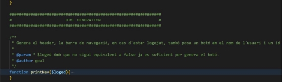
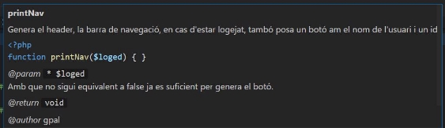
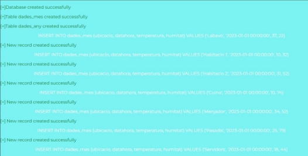
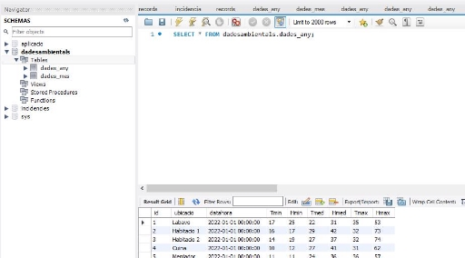
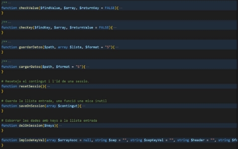
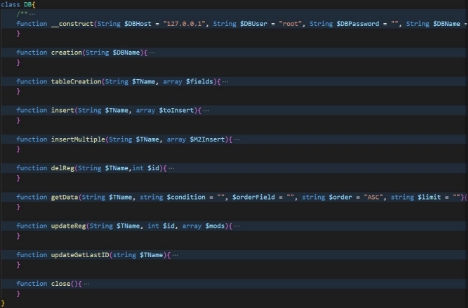
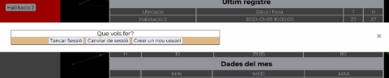
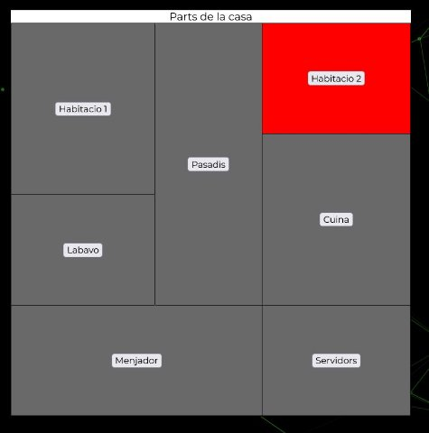
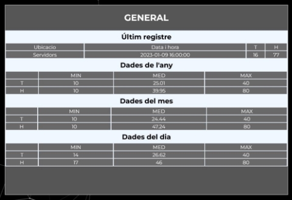
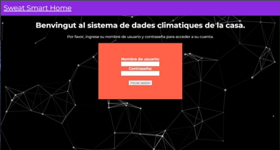

[1.ENTORN DE   DESENVOLUPAMENT .......................................................................................... 3 ](#_page2_x82.00_y138.92)

2. [CREACIO DE BASE DE DADES .................................................................................................. 4 ](#_page3_x82.00_y70.92)[DEV TOOLS ................................................................................................................................ 4 ](#_page3_x82.00_y144.92)[Funció: createDadesAmbientals ........................................................................................... 4 ](#_page3_x82.00_y184.92)[Funció: genRegs..................................................................................................................... 4 ](#_page3_x82.00_y278.92)
2. [IMPLEMETACIÓ DEL CODI ....................................................................................................... 5 ](#_page4_x82.00_y337.92)[inclusió general_tools ................................................................................................................ 5 ](#_page4_x82.00_y378.92)[inclusió MySQL_PDO ................................................................................................................. 6 ](#_page4_x82.00_y749.92)[Funció: main .............................................................................................................................. 6 ](#_page5_x82.00_y378.92)[HTML GENERATION ................................................................................................................... 6 ](#_page5_x82.00_y560.92)[Funció: printNav .................................................................................................................... 6 ](#_page5_x82.00_y577.92)[Funció: printModal ................................................................................................................ 7 ](#_page6_x82.00_y70.92)[Funció: printHome ................................................................................................................ 7 ](#_page6_x82.00_y253.92)[Funció: printLoginPage .......................................................................................................... 8 ](#_page7_x82.00_y70.92)[Funció: printDatos ................................................................................................................. 9 ](#_page8_x82.00_y70.92)[Funció: printRegUserForm .................................................................................................... 9 ](#_page8_x82.00_y469.92)[SECURITY ................................................................................................................................. 10 ](#_page9_x82.00_y70.92)[Funció: checkLog ................................................................................................................. 10 ](#_page9_x82.00_y111.92)[Funció: checkPasswd ........................................................................................................... 10 ](#_page9_x82.00_y420.92)[PROCESSAT DE DADES ............................................................................................................. 11 ](#_page10_x82.00_y237.92)[Funció: processLast ............................................................................................................. 11 ](#_page10_x82.00_y277.92)[Funció: procesSet ................................................................................................................ 11 ](#_page10_x82.00_y483.92)[Funció: procesSetY .............................................................................................................. 12 ](#_page11_x82.00_y70.92)[JAVASCRIPT ................................................................................................................................. 12 ](#_page11_x82.00_y295.92)[Funció: scriptModal ............................................................................................................. 12 ](#_page11_x82.00_y316.92)[Funció: scriptAnimBg........................................................................................................... 12 ](#_page11_x82.00_y397.92)[4.DEMO ................................................................................................................................... 13 ](#_page12_x82.00_y70.92)

1.ENTORN DE   DESENVOLUPAMENT

El entorn de desenvolupament que hem fet servir es un Repositori de GitHub compartit on hem pujat tots els fitxers a mes a nivell de programari hem fet servir el visual Studio on cada un te el XAMPP i el WAMP hem utilitzat un estil de programació estructurada que consisteix en posar comentaris en el codi a mes a mes hem utilitzat de el camel case.  

 

2. CREACIO DE BASE DE DADES 

Per crear la base de dades hem utilitzat aquestes funcions per poder generar els registres i també la creació de base de dades. 

DEV TOOLS

Funció: createDadesAmbientals

Fa ús de la llibreria MySQL\_PDO per connectar a la base de dades local, crear una base de dades, 2 taules dades mes 

i dades any i a continuació en cas de estar descomentat, crida a la Funció: genRegs. Funció: genRegs

Fa ús de la mateixa llibreria per inserir a les dues taules un molt complert conjunt de registres 

dades\_mes: Genera 3 registres diaris amb valors aleatoris per cada habitació en 3 moments diferents del dia.

dades\_any: Genera 1 registre diari amb valors aleatoris per cada habitació. 

3. IMPLEMETACIÓ DEL CODI 

inclusió general\_tools 

Aquest fitxer serveix per funcions complementaries, son com una caixa d’eines personal  

inclusió MySQL\_PDO

Aquest fitxer la fem servir per tot el tema de creació de dades i la creació de la pròpia base de dades.

Funció: main

Primer de tot si trobem el POST de tacar la sessió la destruïm abans de comprovar si esta logejat, després comprovem el cas que l'administrador volguí crear un usuari i si te permisos, si no es així, en cas d'estar logejat printara la pàgina d'inici,

la qual depenent de si li passem una part per la casa o no, mostrarà unes dades o altres, finalment si no esta logejat,

printara la pàgina de logeig.

HTML GENERATION

Funció: printNav

Genera el “header”, la barra de navegació, en cas d'estar logejat, també posa un botó amb el nom de l'usuari i un ID 

Parametres: \* $loged Amb que no sigui equivalent a false ja es suficient per genera el botó. 

Funció: printModal  

Printa un modalbox, un div ocult amb un formular, aquest es torna visible quan s'executa un script.

Funció: printHome 

Genera uns plànols d'una casa, amb un formulari que com a "action" s'apunta a si mateix, i un botó per cada part de la casa, i aplica un "classe"(CSS) sobre la secció seleccionada. 

Paràmetres: string $section si la string que es passa coincideix amb una part de la casa aquesta quedarà amb un Class per que s'apliqui un estil diferent, per defecte es "GENERAL", i només en aquest cas, aplica la classe a tots els elements. 

Funció: printLoginPage 

Genera un div amb un títol i una classe depenent de la part de la part de la casa passada pel POST. 

Paràmetres: array $LData array multidimensional amb l’últim registre i una array dirigida a ser la capçalera de la taula.

Paràmetres: array $YData array multidimensional amb els registres de l'any anterior i una array dirigida a ser la capçalera de la taula.

Paràmetres: array $MData array multidimensional amb els registres d'aquest mes i una array dirgida a ser la capçalera de la taula.

Paràmetres: array $DData array multidimensional amb els registres d'avui i una array dirigida a ser la capçalera de la taula.

Funció: printDatos

Genera la pàgina de "Login", amb un formulari que com a "action" s'apunta a si mateix, el nom d'usuari es autocompletable.

Paràmetres: string $userName Per defecte es una string buida, el que li pesem, serà el valor per defecte del camp "username"

Funció: printRegUserForm

Genera la pàgina de "Signup" o registre, amb un formulari que com a "action" s'apunta a si mateix 

SECURITY  Funció: checkLog

Inicia la sessió, i comprova els valors de $\_POST per decidir si intentar logejar o registrar un nou usuari (sense permisos), 

en cas de logeja un nou usuari mantindra la sessió anterior (usuari creador) oberta, en cas de ser un intent de "login"

i de ser correcta la contrasenya, guarda el "username" a la sessió i a la cookie, però també és molt important que a mes,

a la cookie guarda l'identificador de la sessió (l'ús s'explica en el main) i finalment, en cas d trobar les dades ja emmagatzemades,

retorna true

Retorna : array|bool en cas de logejar correctament, retorna les dades de l'usuari, sinó, retorna false.

Funció: checkPasswd

En cas de que el nom d'usuari i contrasenya siguin correctes, retorna les dades de l'usuari trobades al mateix 

fitxer que hem utilitzat per comprovar la contrasenya, en cas contrari retorna false.

Paràmetres: string $username El nom d'usuari del que volem comprovar la contrasenya i/o rebre les dades.

Paràmetres: string $passwd La contrasenya que correspon a l'usuari, es necessària per retornar les dades.

Retorna : array|bool Retorna false en cas de no coincidir la contrasenya i en cas que sí, retorna les dades de l'usuari,

trobades a l'arxiu, usersData.json com ara el permís per crear usuaris.

PROCESSAT DE DADES Funció: processLast

Prepara les dades de l’últim registre rebut de la base de dades en un format de array multidimensional, afegint-li les capçaleres.

Parametres: array $dataL Rep les dades crude de la resposta de la base de dades. Retorna : array l'array multidimensional preparada per ser mostrada en forma de taula.

Funció: procesSet

Prepara les dades mensuals o diàries rebudes de la base de dades en un format de array multidimensional, afegint-li les capçaleres.

Parametres: array $data Rep les dades crude de la resposta de la base de dades. Retorna : array l'array multidimensional preparada per ser mostrada en forma de taula.

Funció: procesSetY

Prepara les dades anuals rebudes de la base de dades en un format de array multidimensional, afegint-li les capçaleres.

Paràmetres: array $dataY Rep les dades crude de la resposta de la base de dades. Retorna : array l'array multidimensional preparada per ser mostrada en forma de taula.

JAVASCRIPT Funció: scriptModal

Insereix un script que permet que amb el botó amb el nom d'usuari, es faci visible un formulari ocult.

Funció: scriptAnimBg

Posa un div que farà de fons animat, carrega la configuració per defecte d'un arxiu json i l'edita canviant el color

de les partícules en cas d’haver seleccionat una part de la casa en específic. 

4.DEMO 

Per preparar la demostració hem fet servir la pròpia documentació i també la pagina web  

